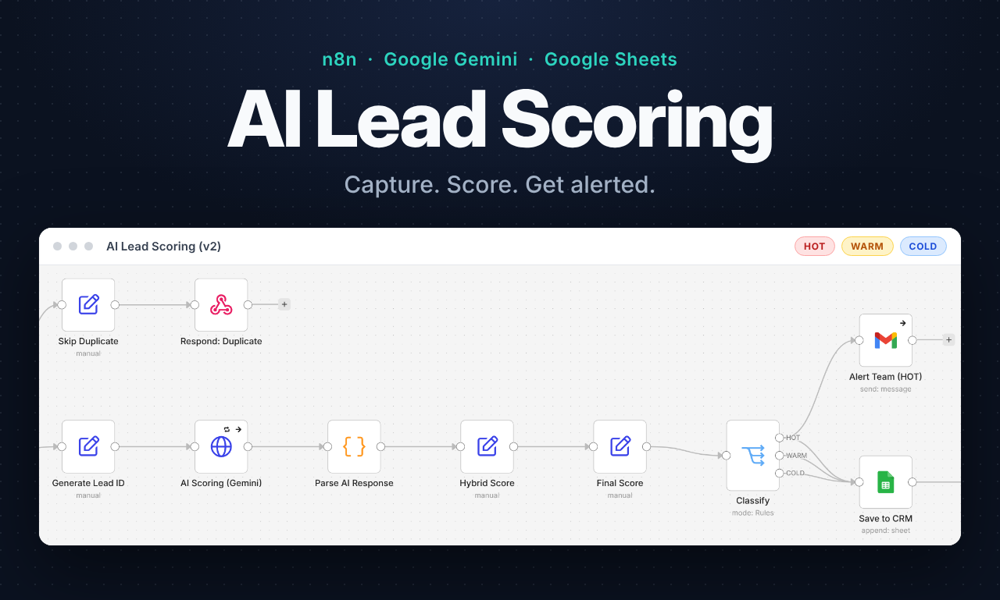
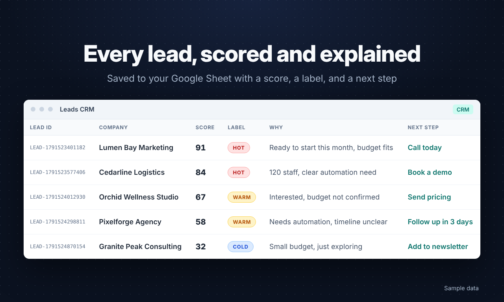

# AI-Based Lead Management & Scoring System

An automated n8n workflow that takes a lead from a website form to a scored, labeled
row in Google Sheets, with no manual sorting. Built as the final project of an
AI & Automation internship at Orange Digital Center Egypt × Instant Software
Solutions, then improved in v2 (see the
[changelog](https://github.com/bodamansour/lead-management-n8n/blob/main/CHANGELOG.md)).



Instead of someone reading every new lead, checking for duplicates, and guessing
who to call first, the workflow validates each submission, skips duplicates,
scores the lead with Google Gemini plus business rules, labels it HOT, WARM, or
COLD, saves it to Google Sheets, emails the lead a confirmation, and alerts the
team about HOT leads.

## Features

- **Lead intake and validation**: receives leads through a webhook (JSON or a
  normal HTML form) and rejects missing names or invalid emails with HTTP 400.
- **Duplicate detection**: looks up the lead's email in the sheet and replies
  `duplicate` instead of saving it twice.
- **Lead ID**: gives every new lead a traceable ID like `LEAD-1791518069546`.
- **AI scoring**: Google Gemini returns a score, a reason, a priority, and a
  recommended next step. Names, emails, and phone numbers are not sent to the AI.
- **Hybrid score**: 60% business rules (budget, company size, message intent)
  and 40% AI. If the AI call fails, the lead is scored with the rules only.
- **HOT / WARM / COLD labels** with thresholds you can change.
- **Google Sheets CRM**: every lead is saved with its score, label, and reason.
- **Emails**: a confirmation to the lead and an alert to the team for HOT leads.
- **Extras**: an error alert workflow and a daily lead summary email.



## Workflow

```
Webhook (new lead)
   → Config
   → Normalize Data
   → Validate Lead ──(invalid)──→ Reject Invalid → Respond: Invalid (400)
   → Duplicate Check (by email)
   → Is Duplicate? ──(yes)──→ Skip Duplicate → Respond: Duplicate
   → Generate Lead ID
   → AI Scoring (Gemini)
   → Parse AI Response (falls back to rules only if the AI fails)
   → Hybrid Score
   → Final Score
   → Classify (HOT / WARM / COLD) ──(HOT)──→ Alert Team (HOT)
   → Save to CRM (Google Sheets)
   → Send Confirmation Email
   → Respond: Success
```

## Tech Stack

- **n8n**: workflow orchestration
- **Google Gemini API**: AI scoring and reasoning
- **Google Sheets**: CRM storage and duplicate lookups
- **Gmail**: confirmation and alert emails
- **Webhook**: lead intake from a website or form tool

## Files

| File | What it is |
| --- | --- |
| `lead management.json` | The main workflow (v2) |
| `crm-columns.csv` | Header row for the Google Sheet |
| `extras/error-alert.json` | Emails you if a workflow fails |
| `extras/daily-lead-summary.json` | Daily email: new leads, HOT leads, follow-ups due |
| `extras/test-form.html` | A small form for sending test leads |

## Setup

1. **Google Sheet**: create a sheet, name the tab `CRM`, and paste the header
   row from `crm-columns.csv` into row 1.
2. **Import**: in n8n, go to Workflows → Import from File and choose
   `lead management.json`.
3. **Credentials**:
   - Google Sheets OAuth2 for **Duplicate Check** and **Save to CRM**
   - Gmail OAuth2 for **Send Confirmation Email** and **Alert Team (HOT)**
   - A **Header Auth** credential for Gemini: name `x-goog-api-key`, value
     your Gemini API key. Select it in **AI Scoring (Gemini)**.
4. **Sheet ID**: paste your sheet's ID (the part of the URL between `/d/` and
   `/edit`) into **Duplicate Check** and **Save to CRM**.
5. **Config node**: set your company name, the team email for alerts, your
   scoring criteria, the HOT/WARM thresholds, the weights, and the Gemini model.
6. **Go live**: publish the workflow and copy the production URL from the
   **Webhook** node (it ends with `/webhook/lead-scoring`).
7. **Optional extras**: import `extras/error-alert.json` and set it as the
   main workflow's error workflow; import `extras/daily-lead-summary.json` for
   a 9:00 daily summary.

## Test it

Open `extras/test-form.html` in a browser, paste the webhook URL, pick a
sample lead, and send it. Or with curl:

```bash
curl -X POST "YOUR_WEBHOOK_URL" -H "Content-Type: application/json" \
  -d '{"name":"Test Lead","email":"test@example.com","company":"Acme","employees":40,"budget":3000,"service":"Automation","message":"We need to automate our follow ups"}'
```

Expected reply: `{"status":"received","lead_id":"LEAD-..."}` and a new row in
the sheet. Required fields are `name` and `email`; `phone`, `company`,
`industry`, `employees`, `budget`, `service`, `message`, and `source` are
optional. Values like `$5,000` work for budget and employees.

## Scoring rules

The rule score is out of 80 and scaled to 100:

- **Budget**: 5,000+ = 30, 2,000+ = 25, 500+ = 15, less = 5
- **Company size**: over 200 = 20, 51+ = 15, 11+ = 10, less = 5
- **Message intent**: buy / start / now / ready / asap = 30;
  need / want / implement / automate = 20; interested = 10; other = 5

Final score = 60% rules + 40% AI. HOT is 80 or more, WARM is 50 or more, and
everything else is COLD. You can change the weights and thresholds in **Config**.

## Data and privacy

- Names, emails, and phone numbers stay out of the AI prompt. The company
  details and the lead's message are sent to Gemini.
- Use a billed Gemini API key for real leads. Google's Gemini API terms say
  free-tier content may be used to improve Google products, while paid usage
  isn't.

## Known limitations

- The AI score is only as good as the details the lead fills in.
- Google Sheets works well for small teams; a dedicated CRM (HubSpot,
  Airtable) would scale better for high lead volume.
- The AI helps prioritize. A person should make the final decision on each lead.
